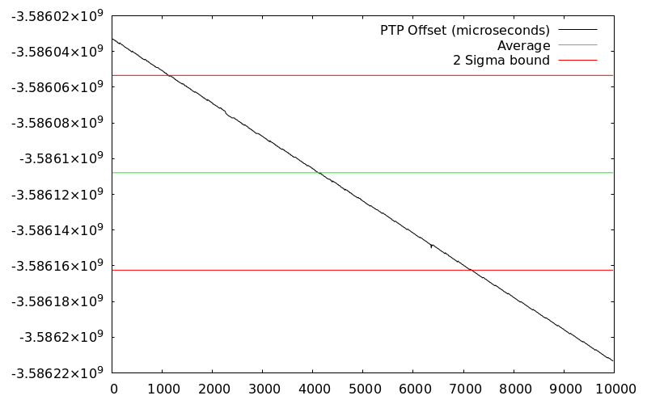
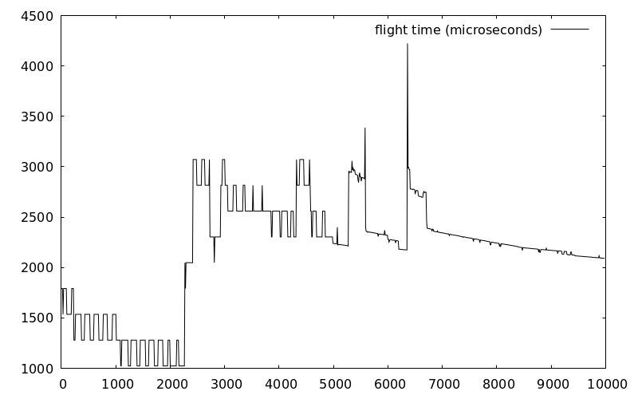

# rid

This crate is meant to be shared by a client and host communicating over USB. 

Currently the only host programs are tests in this repo. 

To run the tests make sure to use the std feature

    cargo test --features="std" <test_name>

To build and open the docs run

    cargo doc --open

## Test Results

PTP Offset Error: difference in measured times and estimated times

PTP Offset: offset calculation over time

Linear offset conversion: C(t) = m * H(t) + b

Packet flight times: host time (milliseconds) vs flight time (microseconds)

# Testing

## HIL Testing

  RID intends to build highly iterable tests and validation. This is done
by placing a Teensy in the loop (Hardware In the Loop). This type of testing 
will consist of a host machine and Teensy connected via USB. It should always 
be assumed that the hardware contains the full firmware implementation 
but this should not be required by module or integration tests.

## Module Testing

  Not all Modules require HIL testing, but all modules should be
tested before integration tests are performed. See docs for module list.

### PTP Performance

  This is a HIL and module test. The file rid/tests/ptp_performance.rs provides
a host side implementation of an HIDRAW driver and PTP algorithm. The firmware 
lives in another repo but utilizes the same RID crate. With firmware flashed run

    cargo test --features="std" ptp_performance -- --nocapture

### RTNT Tests

  These tests demonstrate the process of loading a system from a toml file and
parsing that file into TaskNodes. This is a module test that does not involve hardware.
By forcing a host to configure some nodes, the same nodes should be initialized in the 
Teensy. TaskManagers will output and share the proper RID packets to the remote TaskManager.
The goal for these tests is to make sure nodes output data, config data and number of nodes
is constant between the two TaskManagers.

    cargo test --features="std" rtnt_load_panic_load_load_panic -- --nocapture

    cargo test --features="std" rtnt_load_reconfigure -- --nocapture

## Integration Testing

  Once basic functionality for Modules has been established start integration tests.
Integration tests should not be concerned with specific numerical inputs and outputs.
Instead integration tests assert that the status of a system is always correct.

