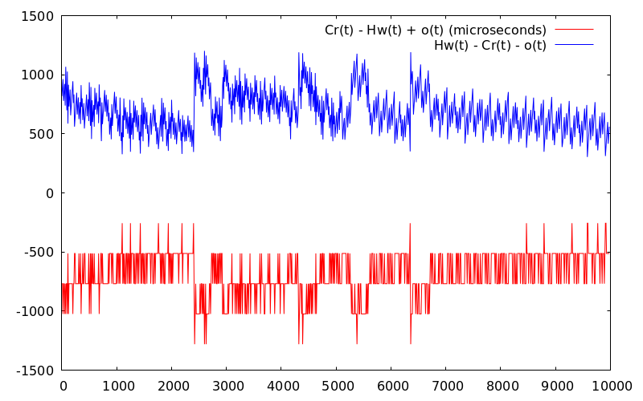

# rid

This crate is meant to be shared by a client and host communicating over USB. 

Currently the only host programs are tests in this repo. 

To run the tests make sure to use the std feature

    cargo test --features="std" <test_name>

To build and open the docs run

    cargo doc --open

## Test Results

PTP Offset Error: difference in measured times and estimated times

PTP Offset: offset calculation over time

Linear offset conversion: C(t) = m * H(t) + b

Packet flight times: host time (milliseconds) vs flight time (microseconds)
